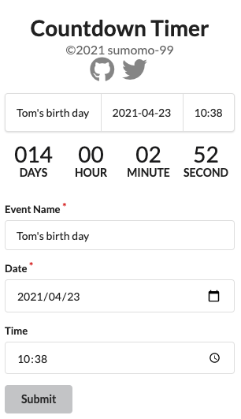
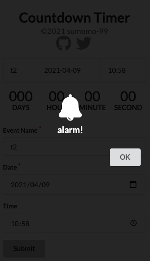

# Countdown Timer
イベントの予定日時までのカウントダウンを行うタイマーアプリケーションです。




## デモURL
[https://countdown-timer-sumomo-99.vercel.app/](https://countdown-timer-sumomo-99.vercel.app/)

## 開発サーバの起動
```bash
npm install
npm run dev
```
ブラウザで[http://localhost:3000](http://localhost:3000)にアクセスします。

## ビルド
```bash
npm run build
```